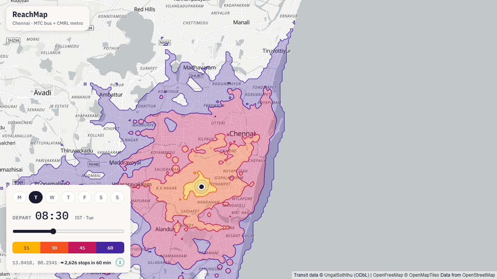
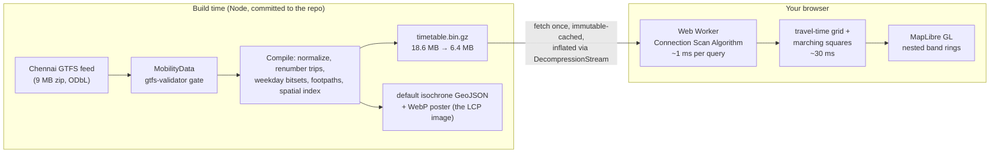
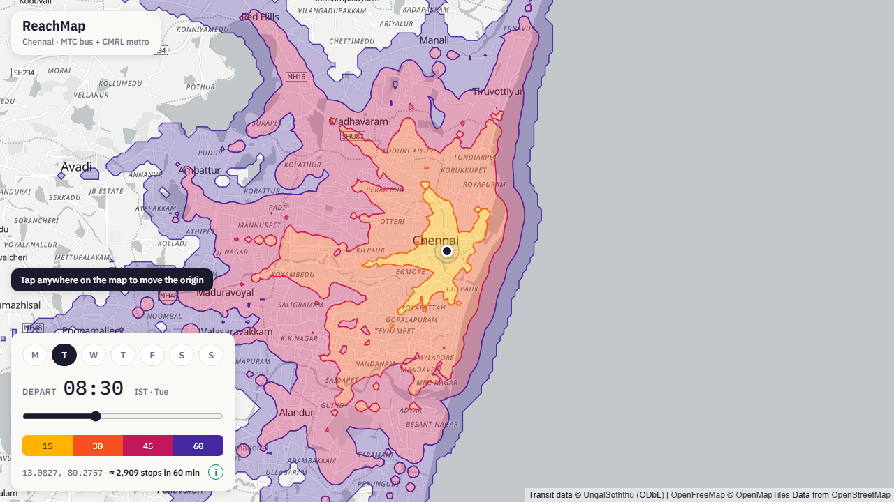
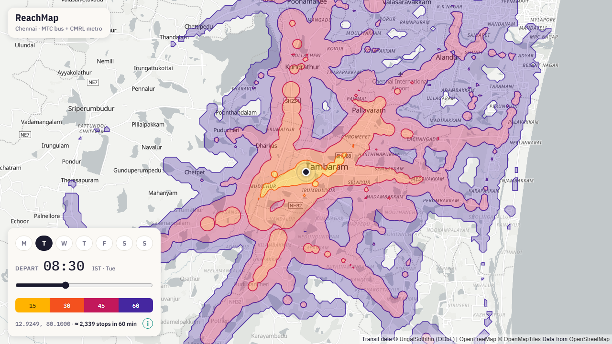

# ReachMap

**Where can Chennai's buses and metro take you in an hour?**

Click anywhere on the map, pick a departure day and time, and see the area
you can reach in 15 / 30 / 45 / 60 minutes — computed from the city's real
published timetable, entirely in your browser.

**Live: [reachmap.vercel.app](https://reachmap.vercel.app)**

[](https://reachmap.vercel.app)

*60 minutes from T. Nagar on a Tuesday morning: 2,626 stops. The bands are
door-to-door — walking, waiting, riding, transfers, walking again — and they
stop honestly at the Bay of Bengal.*

## What it is

A transit **isochrone** map for Chennai (MTC bus + CMRL metro, 5,580 stops,
47,047 trips, 1.31 million timetabled connections). Move the origin, change
the departure time, watch the reachable city reshape. Late evening thins the
bands dramatically; Sundays run slightly lighter service. Everything the map
shows is derived from the timetable — nothing is estimated or interpolated
from thin air.

## How it works

The unusual part: **there is no server**. The whole routing engine runs in a
Web Worker in your browser, over a compiled binary timetable served as a
static file.



Per click: a **Connection Scan** sweep over 1.3 M connections (~1 ms),
then a 200 m travel-time grid contoured into four nested polygons (~30 ms).
Band nesting is guaranteed mathematically — all four are level sets of one
scalar field — and verified by point-sampling tests anyway.

Design decisions are written up as ten ADRs in [docs/adr/](docs/adr/) —
why CSA beat RAPTOR, why the timetable ships as an opaque `.bin.gz`
(Vercel never compresses `application/octet-stream`; browsers can't
`DecompressionStream` brotli), why the after-midnight scan needs two merged
cursors, why the LCP element is a build-time poster (a `<canvas>` can never
be the LCP). The full byte layout and worker protocol live in
[docs/contracts.md](docs/contracts.md).

## The correctness story

Transit engines fail silently — an isochrone that's 20% too small still
looks plausible. The defenses, all running in CI on every PR:

- **Property tests**: no arrival before departure across randomized queries;
  band polygons verified nested by ray-cast point sampling.
- **Timetable oracles**: ride a trip straight out of the raw `stop_times.txt`
  and the engine must arrive no later than the printed schedule.
- **After-midnight regressions**: a Monday 00:30 query must see Sunday's
  25:00 trips *and* let their riders transfer onward — with test distances
  chosen so walking can't mask a broken scan.
- **Determinism**: same feed + same config ⇒ byte-identical artifact.
- **Adversarial review**: at three stages, independent review agents attacked
  the specs and code; ~35 findings were confirmed by verification and fixed —
  including one that mattered enormously: the map library's worker silently
  failed to load under the bundler, tiles never rendered, and a well-behaved
  placeholder image masked it. Only insisting on rendered-pixel verification
  of the live site caught it.
- **End-to-end**: Playwright drives the production build (click → bands,
  time change, day toggle, mobile sheet, zero console errors) and a live
  verifier re-checks the deployed URL from three origins.

Honesty is a feature elsewhere too: clicks in transit deserts get a
walk-only answer, out-of-coverage clicks say so instead of snapping the pin,
and the ⓘ panel discloses the feed's provenance and every skipped malformed
row.

## Performance

| | |
|---|---|
| Engine query | ~1 ms (p95 0.9 ms over 300 random queries) |
| Full click → bands | ~33 ms in the worker |
| Timetable on the wire | 6.4 MB gzip, fetched once, cached immutable |
| Lighthouse performance | 98 (CI, calibrated) · 85 under strict 4× mobile throttling |
| First paint | static poster of the real default isochrone; MapLibre mounts on first user intent |

## Data

Timetable © [UngalSoththu / Ithu Ungal Soththu](https://github.com/ungalsoththu/ChennaiGTFS),
an unofficial community feed, used under **ODbL**. MTC data was collected
from the operator's app; CMRL schedules derive from published headways;
suburban rail is not included. Basemap © [OpenFreeMap](https://openfreemap.org)
/ OpenMapTiles / OpenStreetMap. The city selection itself was a finding:
Kolkata publishes no GTFS at all, and Delhi's "open" transit data is not
openly licensed — the research trail is in [docs/research.md](docs/research.md).

## Run it yourself

```bash
pnpm install
pnpm build:data   # download feed → validate (Java 17) → compile artifacts
pnpm dev          # app on :3000
pnpm test         # 51 unit/property/oracle tests
pnpm e2e          # Playwright against a production build
pnpm perf         # Lighthouse gate
```

Everything city-specific lives in one file — [config/city.ts](config/city.ts).
Point it at another GTFS feed and the same pipeline, gates, and UI apply.

## Repo tour

| | |
|---|---|
| [PROJECT_LOG.md](PROJECT_LOG.md) | the full build log: 14 staged roles, every decision, every found bug |
| [docs/adr/](docs/adr/) | ten architecture decision records |
| [docs/contracts.md](docs/contracts.md) | binary artifact layout, manifest schema, worker protocol |
| [docs/research.md](docs/research.md) | the GTFS/basemap/platform research with sources |
| [docs/PRD.md](docs/PRD.md) · [docs/ux.md](docs/ux.md) · [docs/testing.md](docs/testing.md) | product, UX spec, test strategy |

<p align="center">
  
  
</p>
